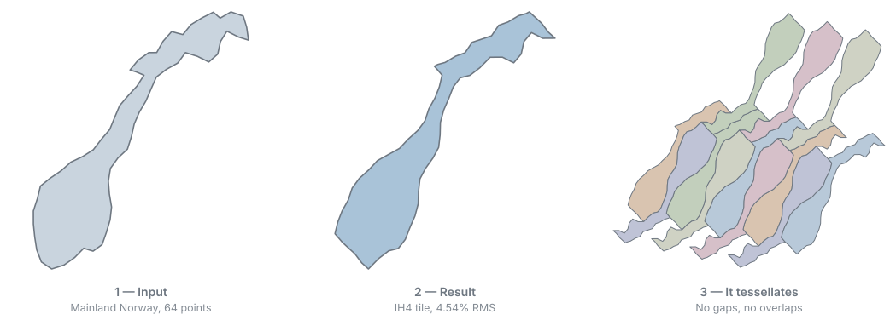

# Escherize

Finn fliser som legger planet og ligner en gitt silhuett.

Gi programmet en form — et bilde, et polygon, eller konturen av et land — og det søker
gjennom de ni generelle isohedrale flisleggingstypene etter de flisene som ligner mest på
formen din og samtidig flislegger planet uten glipper eller overlapp. Det er det M.C.
Escher gjorde for hånd med øgler og fugler, løst som et optimeringsproblem.

Ut kommer polygonet: som JSON, som SVG, som DXF i millimeter for kutter, og som vanntett
STL for 3D-print.



## Eksempel

Norges fastland, tilpasset til IH4, flislagt:

```
escherize run --input norge.geojson --n 64 --min-neck 0.12 --out ut
```

```
rank  type   rms %   neck   k
   1  IH4     4.54  0.122  [2,11,17,20,6]
   2  IH4     4.58  0.122  [1,12,17,22,5]
```

Kystlinja er den ekte, deformert 4,5 % — nok til å lukke flisleggingen, lite nok til at
formen fortsatt er Norge.

`--min-neck 0.12` er det som gjør flisen produserbar. Norges smaleste punkt er 6,3 km, og
akkurat der vil en flis knekke; grensen tvinger fram en hals på rundt 6 mm ved 120 mm
flisstørrelse. Uten den finnes det nærmere treff, men de tåler ikke å bli plukket opp.

### Printet

<!-- Bytt ut med foto av de printede flisene, gjerne flere lagt sammen ovenfra.
     Legg bildet i docs/images/ og oppdater stien under. -->

`produserbar/rank01_IH4_tile.stl` — 120 × 102 × 6 mm, 252 trekanter, vanntett. Flatt på
plata, uten støtter.

## Kom i gang

Krever .NET 8. Windows er testplattformen, men koden er ren BCL og bør kjøre hvor som
helst .NET 8 gjør.

```powershell
.\build.ps1                                        # bygger og kjører testene
escherize run --input min-form.png --out ut        # søk
escherize verify --result ut\summary.json          # bekreft at flisene faktisk tiler
```

`HOWTO.md` er den praktiske bruksanvisningen: hvordan få formen inn, hva knottene gjør,
og hvordan hente ut polygonet.

## Metoden

Den uttømmende varianten av Koizumi–Sugiharas formulering, slik den er beskrevet i
Nagata & Imahori, *An Efficient Algorithm for the Escherization Problem in the Polygon
Representation*, [arXiv:1912.09605](https://arxiv.org/abs/1912.09605) (2019).

Kort fortalt: hver flisleggingstype gir et lineært underrom av tillatte flisformer.
Avstanden fra silhuetten til det nærmeste punktet i underrommet har lukket form, så søket
kan gå gjennom alle kombinasjoner av type, punktfordeling, startpunkt og omløpsretning og
rangere dem eksakt. En evaluering koster konstant tid uavhengig av hvor mange punkter
flisen har.

## Prosjektet

```
src/Escherize.Core/       geometri, maler, parametrisering, søk, rendering (kun BCL)
src/Escherize.Imaging/    PNG → binærmaske → kontur
src/Escherize.Cli/        kommandolinjeverktøyet
tests/Escherize.Tests/    213 tester, med MathNet som uavhengig orakel
bench/Escherize.Bench/    ytelsesmåling
```

- `SPEC.md` — spesifikasjonen programmet er bygget etter
- `HOWTO.md` — bruksanvisning
- `DECISIONS.md` — valg som ikke følger av spesifikasjonen, med målingene bak

## Ytelse

Alle ni typer, begge omløpsretninger, åtte tråder:

| n | Tid |
|---|---|
| 60 | 3,7 s |
| 96 | 24 s |
| 120 | 66 s |

Én evaluering av IH4 ved n = 120 tar 294 ns.

## Lisens

MIT, se `LICENSE`.

Avhengighetene er StbImageSharp (public domain), og — kun i tester og målinger —
MathNet.Numerics, xUnit og BenchmarkDotNet (MIT/Apache-2.0).

Artikkelen distribueres ikke med repoet; last den ned fra arXiv-lenken over.
